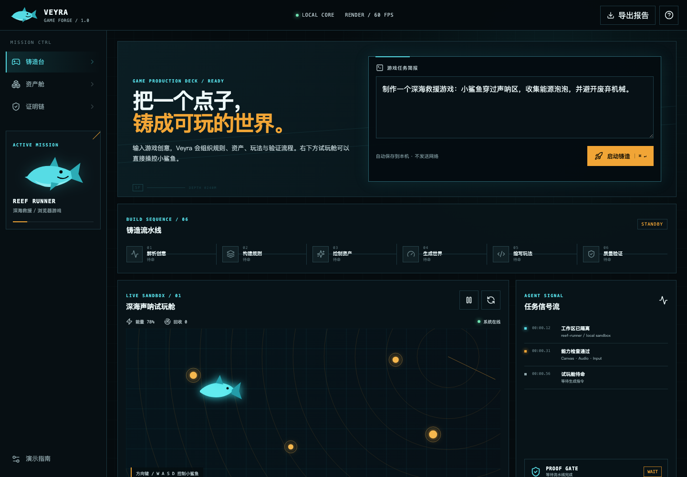

# Veyra

> 从一句游戏创意，到可玩、可检查、可交付的浏览器原型。

Veyra 是一个为作品集与产品演示设计的 AI 游戏创作工作台概念。当前版本完整实现了任务简报、六阶段生成演示、实时事件流、资产舱、证明链，以及一款可以直接操作的小鲨鱼 Canvas 游戏。



## 在线演示

**https://macistone71-jpg.github.io/Veyra/**

## 亮点

- **任务可视化**：把模糊创意拆为解析、规则、资产、世界、玩法和验证六个阶段。
- **真实可玩**：使用方向键或 `W A S D` 操作小鲨鱼收集能源泡泡；移动端提供触控方向键。
- **证据链设计**：资产来源、响应式、可访问性与构建产物均有明确说明。
- **原创视觉**：小鲨鱼、声呐网格和能源粒子均由项目内 SVG / Canvas 程序化绘制。
- **可直接展示**：支持 GitHub Pages；桌面双击 `启动演示.command` 也可运行。

## 本地运行

需要 Node.js 20 或更高版本。

```bash
npm install
npm run dev
```

也可以在 macOS 中双击 `启动演示.command`。

## 构建

```bash
npm run build
npm run preview
```

## 90 秒面试演示路径

1. 用一句话说明目标：让非技术创作者看懂“创意如何变成可验证的游戏产物”。
2. 修改任务简报并点击“启动铸造”，展示流程状态和信号流同步。
3. 在试玩舱中操作小鲨鱼，证明页面不是静态视觉稿。
4. 打开“资产舱”和“证明链”，解释原创资产、可访问性与工程取舍。

## 设计与实现说明

- 产品方向与作品定义：David（[@macistone71-jpg](https://github.com/macistone71-jpg)）
- 实现方式：AI 辅助开发，由项目负责人提出需求、选择方案并验收
- 技术栈：React 19、TypeScript、Vite、Canvas 2D、Lucide Icons
- 设计记忆：见 [`design-system/veyra`](design-system/veyra)

## 来源与边界

本项目是从零实现的独立作品。产品概念研究参考了 [Noobi.ai](https://github.com/Innate-Labs/Noobi.ai) 的公开产品介绍，但**未复制其源代码、视觉资产、名称或卡通形象**。Noobi.ai 仓库在本项目创建时未提供开源许可证，因此其代码不包含在本仓库中。

## License

MIT © 2026 David / macistone71-jpg
